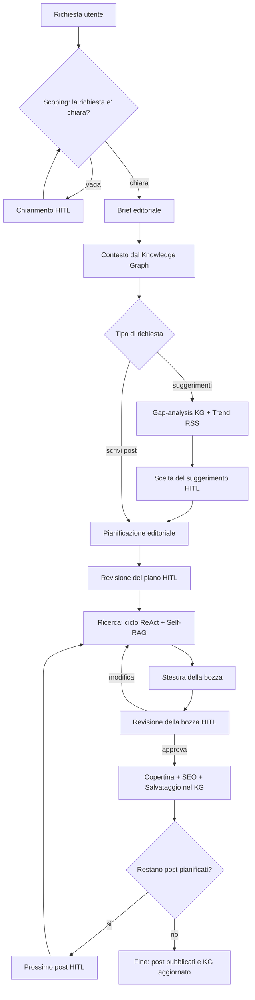

# AutomotiveBloggerAgent — Assistente Editoriale Agentico (A.A. 2025-2026)


## Descrizione del Progetto

**AutomotiveBloggerAgent** è un assistente editoriale **agentico** che automatizza l'intero ciclo di vita di un articolo per il blog automotive AutomotiveAI: dalla richiesta in linguaggio naturale dell'utente fino al post pubblicato, corredato di fonti verificate, immagine di copertina, analisi SEO e registrazione nella memoria editoriale.

L'agente non è un semplice "wrapper" attorno a un modello: è un **grafo di stato** (costruito con **LangGraph**) che ragiona in modo esplicito (pattern **ReAct**), pianifica più articoli, sceglie dinamicamente quali strumenti usare, recupera informazioni da fonti diverse (web, documenti locali, knowledge graph), e si ferma nei punti chiave per chiedere conferma all'utente (**Human-in-the-Loop**). Il sistema gira **interamente in locale** tramite modelli serviti da Ollama, con i soli servizi esterni necessari (ricerca web, generazione immagini, osservabilità).

Il progetto è stato realizzato per il corso di **Cognitive Computing & Artificial Intelligence** (A.A. 2025-2026).

---

## Architettura del Sistema

Il cuore del sistema è un **grafo di stato LangGraph** che orchestra nodi specializzati e strumenti. Attorno ad esso ruotano cinque sottosistemi disaccoppiati, ognuno con una responsabilità precisa.

### I Componenti

1. **Orchestratore LangGraph**
   * Definisce lo stato condiviso (`State`), i nodi (scoping, pianificazione, ricerca, stesura, revisione, pubblicazione) e gli archi condizionali.
   * Gestisce la persistenza tramite checkpointer, requisito necessario per gli interrupt Human-in-the-Loop.

2. **Modelli Locali (Ollama)**
   * **Ministral 3B** — il "cervello" dell'agente: ragionamento ReAct, pianificazione, scelta dei tool, grading delle fonti e routing. Lo stesso modello, con temperature diverse, funge anche da "penna" (stesura) e da "riassuntore" delle fonti web.
   * **Llama 3.2 1B (QLoRA fine-tuned)** — modello specializzato usato come **giudice** nello strumento di confronto tra veicoli.

3. **Knowledge Graph (Neo4j AuraDB)**
   * La **memoria editoriale** del blog: cosa è già stato scritto, su quali argomenti, con quali fonti.
   * Abilita la *gap-analysis* (cosa manca da trattare), la deduplica semantica dei topic e un *backlog* di proposte recuperabili.

4. **RAG locale (ChromaDB)**
   * Recupero semantico da una base di documenti curati (linee editoriali, schede tecniche interne), con embedding `all-MiniLM-L6-v2`.

5. **Server MCP (FastMCP)**
   * Servizio **autonomo** (porta `8765`, transport streamable-http) che incapsula la ricerca web (**Tavily**) e ne restituisce risultati già filtrati e riassunti, isolando la latenza e il rumore delle fonti esterne dal flusso dell'agente.

> Servizi di supporto: **Cloudflare Workers AI** (generazione copertine con FLUX), **LangSmith** (osservabilità e tracing del ciclo ReAct), **Gemini** (giudice esterno nella fase di valutazione).

---

## Funzionalità Principali

| Funzionalità                     | Descrizione                                                  |
| :------------------------------- | :----------------------------------------------------------- |
| **Ragionamento ReAct**           | L'agente alterna esplicitamente *Thought → Action → Observation*, motivando la scelta di ogni strumento; il ciclo è tracciato su LangSmith. |
| **Pianificazione editoriale**    | A partire dalla richiesta, genera un piano di uno o più post strutturati prima di scrivere. |
| **Self-RAG**                     | Valuta la rilevanza delle fonti web recuperate (giudizio binario) e, se non pertinenti, riformula la ricerca. |
| **RAG locale**                   | Recupero da documenti curati con soglia di distanza primaria e rete di sicurezza di fallback. |
| **Knowledge Graph**              | Memoria editoriale, gap-analysis, deduplica semantica dei topic e backlog di proposte *crash-safe*. |
| **Model Context Protocol (MCP)** | Ricerca web incapsulata in un microservizio dedicato, riusabile e isolato. |
| **Architettura multi-modello**   | Modelli e temperature diversi per ruoli diversi (ragionamento, stesura, sintesi, giudizio). |
| **Fine-tuning (QLoRA)**          | Modello da 1B specializzato sul confronto tra veicoli, integrato come strumento. |
| **Human-in-the-Loop**            | Cinque punti di controllo in cui l'agente si ferma e attende una decisione dell'utente. |
| **Osservabilità**                | Tracing completo del ragionamento e delle chiamate ai tool tramite LangSmith. |

### Gli Strumenti dell'Agente

**Strumenti del ciclo ReAct** (scelti dinamicamente dal modello):

| Strumento                 | Funzione                                                     |
| :------------------------ | :----------------------------------------------------------- |
| `mcp_web_search`          | Ricerca web (via MCP/Tavily) con sintesi delle fonti.        |
| `fetch_vehicle_specs`     | Scheda tecnica e storia di **un singolo** veicolo (API-Ninjas + fallback Wikipedia). |
| `compare_vehicles`        | Confronto strutturato tra **due** veicoli, giudicato dal **modello fine-tuned**. |
| `fetch_automotive_trends` | Trend e notizie dai feed RSS di testate automotive.          |
| `query_knowledge_graph`   | Interroga la memoria editoriale (storia e coerenza).         |

**Strumenti deterministici** (invocati dal grafo, non scelti dal modello):

| Strumento                     | Funzione                                                     |
| :---------------------------- | :----------------------------------------------------------- |
| `retrieve_local_documents`    | RAG locale, pre-iniettato nel contesto.                      |
| `update_knowledge_graph`      | Salva post, topic, fonti e claim nel KG.                     |
| `list_blog_topics`            | Elenca i topic già trattati (gap-analysis).                  |
| `get_editorial_context`       | Recupera il contesto editoriale per la coerenza.             |
| `generate_cover_image`        | Genera la copertina del post (Cloudflare FLUX).              |
| `analyze_seo_and_readability` | Analisi SEO e leggibilità (indice **Gulpease**, adatto all'italiano). |

---

## Le Fasi del Grafo: come nasce un articolo

Dall'idea dell'utente all'articolo pubblicato, il grafo attraversa una sequenza di fasi. Nei punti contrassegnati con **(HITL)** l'esecuzione si **mette in pausa** e attende una decisione umana.



1. **Scoping** — Se la richiesta è vaga, l'agente si ferma e chiede un chiarimento *(HITL)*; altrimenti produce un **brief editoriale**.
2. **Contesto dal Knowledge Graph** — Recupera cosa è già stato pubblicato sul tema, per garantire coerenza ed evitare ripetizioni.
3. **Pianificazione** — Genera un piano di uno o più post. *(Per le richieste di soli suggerimenti, il flusso passa invece per gap-analysis + trend RSS e una scelta dell'utente.)*
4. **Revisione del piano** *(HITL)* — L'utente approva, modifica o scarta le proposte in linguaggio naturale.
5. **Ricerca (ReAct)** — L'agente ragiona e sceglie gli strumenti (web, schede tecniche, confronto, KG), con **Self-RAG** sulle fonti web e guardrail anti-loop.
6. **Stesura** — Il modello "penna" scrive la bozza a partire dalle fonti raccolte.
7. **Revisione della bozza** *(HITL)* — L'utente approva, chiede modifiche (e si torna alla stesura/ricerca) o scarta.
8. **Pubblicazione** — Genera la **copertina**, calcola le metriche **SEO/leggibilità** e **salva** post, topic, fonti e claim nel Knowledge Graph.
9. **Prossimo post** *(HITL)* — Nel caso di più post pianificati, l'utente decide se proseguire; le proposte non scritte restano nel backlog recuperabile.

---

## Tecnologie e Pattern

### Core Stack

* **Linguaggio:** Python 3.11.
* **Framework agentico:** LangGraph (grafo di stato, checkpointer, interrupt).
* **Modelli locali:** Ollama — Ministral 3B + Llama 3.2 1B fine-tuned.
* **Knowledge Graph:** Neo4j AuraDB (Cypher).
* **Vector store / RAG:** ChromaDB con embedding `all-MiniLM-L6-v2`.
* **Protocollo strumenti:** Model Context Protocol (FastMCP) + Tavily.
* **Servizi:** Cloudflare Workers AI (FLUX), LangSmith, Gemini (valutazione).

### Schema del Knowledge Graph

* **Nodi:** `Post`, `Topic`, `Source`, `Claim`, `Proposal`.
* **Relazioni:** `COVERS_TOPIC`, `RELATED_TO`, `BASED_ON`, `ASSERTS`.
* I nodi `Proposal` memorizzano una chiave del topic e fungono da **backlog crash-safe** delle idee non ancora scritte.

### Design Patterns

* **ReAct + Tool Use:** ragionamento esplicito con scelta dinamica e giustificata degli strumenti.
* **Self-RAG:** riflessione sulla rilevanza delle fonti prima dell'uso.
* **Human-in-the-Loop:** cinque gate di controllo (`clarify_request`, `review_editorial_plan`, `review_post_draft`, `continue_writing`, `choose_suggestion`).
* **Guardrail deterministici:** dove la scelta corretta è certa (limiti di ricerca, blocco delle chiamate ripetute, regole tassative sui tool, ricerca forzata) si interviene in modo deterministico anziché affidarsi al modello.
* **Deduplica semantica:** i topic sono confrontati per similarità coseno per evitare duplicati nel grafo.
* **Isolamento dei guasti:** lo strumento delle schede tecniche usa un fallback a cascata (API → Wikipedia); la ricerca web è incapsulata nel servizio MCP.

---

## Struttura del Progetto

```
AutomotiveBloggerAgent/
├── main.py                  # Entry point CLI + gestione Human-in-the-Loop
├── config/                  # settings.py (configurazione centralizzata)
├── agent/                   # state.py, graph.py, nodes.py, routing.py, helpers.py, llm.py
├── prompts/                 # system_prompts.py, agent_prompts.py, tool_prompts.py
├── tools/                   # i 5 strumenti ReAct + i 6 deterministici
├── knowledge_graph/         # client.py, queries.py, updater.py, semantic.py, seed.py
├── rag/                     # vectorstore.py, ingest.py, retriever.py
├── mcp_service/             # search_server.py (server MCP autonomo)
└── evaluation/              # crea_dataset.py, evaluate_blog.py (harness di valutazione)
```

---

## Installazione e Avvio

### Prerequisiti

* **Python 3.11**
* **Ollama** installato e in esecuzione, con i modelli scaricati.
* Un'istanza **Neo4j AuraDB** (gratuita).
* Le chiavi API dei servizi esterni (vedi `.env`).

### 1. Dipendenze e modelli

```bash
pip install -r requirements.txt

# Modelli Ollama
ollama pull ministral-3:3b
# il modello fine-tuned va creato dal GGUF + Modelfile prodotti dal notebook di fine-tuning,
# registrandolo come: llama3.2:1b_fine_tuned
```

### 2. Variabili d'ambiente (`.env`)

Crea un file `.env` nella root con le tue chiavi (adatta i nomi a quelli usati in `config/settings.py`):

```env
# Neo4j AuraDB
NEO4J_URI=neo4j+s://xxxxxxx.databases.neo4j.io
NEO4J_USERNAME=neo4j
NEO4J_PASSWORD=...

# Strumenti
NINJAS_API_KEY=...            # schede tecniche veicoli (API-Ninjas)
TAVILY_API_KEY=...            # ricerca web (server MCP)
CLOUDFLARE_ACCOUNT_ID=...     # generazione copertine (FLUX)
CLOUDFLARE_API_TOKEN=...
GOOGLE_API_KEY=...            # giudice Gemini (solo per la valutazione)

# Osservabilità
LANGSMITH_API_KEY=...
LANGSMITH_TRACING=true
```

### 3. Inizializzazione dei dati

```bash
# Popola il Knowledge Graph con una storia editoriale di esempio
python -m knowledge_graph.seed

# Indicizza i documenti locali nel vector store (RAG)
python -m rag.ingest
```

### 4. Avvio (due processi)

Il sistema gira in **due terminali separati**: prima il server MCP, poi l'agente.

```bash
# Terminale 1 — Server MCP (ricerca web), porta 8765
python -m mcp_service.search_server

# Terminale 2 — Agente (CLI)
python main.py
```

> Esempi di richiesta una volta avviato:
>
> * *"Scrivi un post sull'Alfa Romeo Giulia Quadrifoglio"*
> * *"Confronta la BMW Serie 3 e l'Alfa Romeo Giulia"*
> * *"Suggeriscimi argomenti per i prossimi post"*

---

## Valutazione

Il progetto include un harness di valutazione (`evaluation/`) basato su **LangSmith**, che esegue l'agente su dataset di prompt e applica quattro evaluator: qualità del post (giudice LLM), grounding sulle fonti, *failure cases* e correttezza nell'uso degli strumenti. Il modello fine-tuned è stato a sua volta validato con un confronto A/B (base vs fine-tuned) su un test set di veicoli mai visti, misurando metriche semantiche, lessicali, di fluenza e di aderenza al formato.

---

## Autore

Progetto realizzato per il corso di **Cognitive Computing & Artificial Intelligence** (A.A. 2025-2026).

* **Giovanni Maria Contarino** — Matricola: 1000007029
